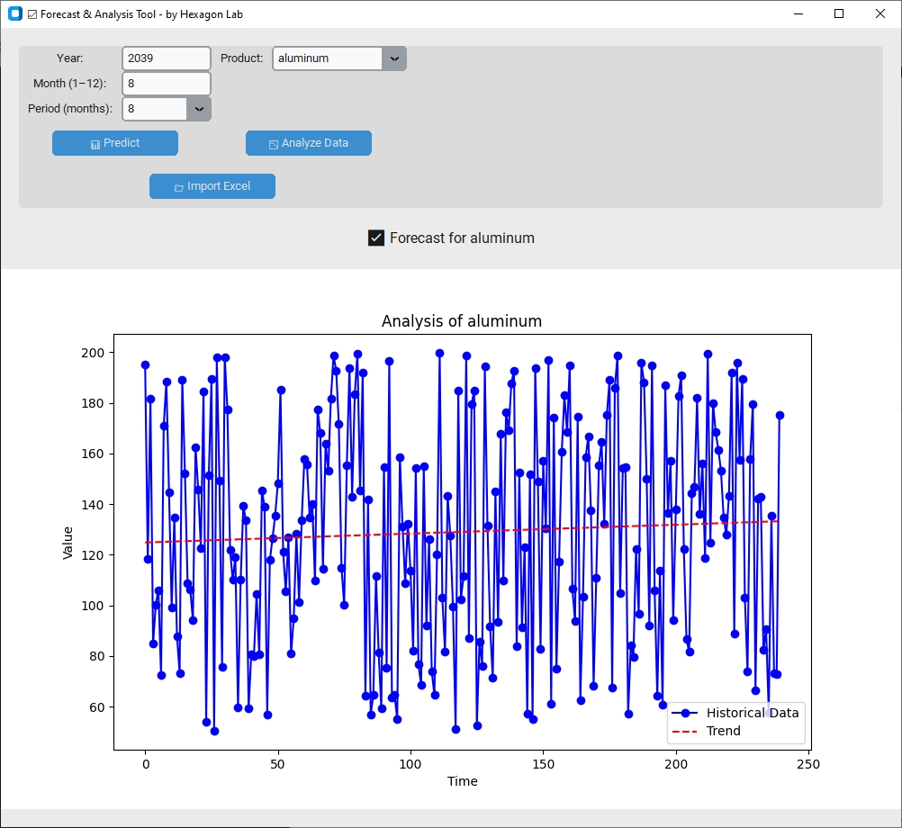

# 📊 Forecast and Value Analysis 2.5 by Hexagon Lab

An interactive GUI application for monthly value forecasting and historical data analysis using machine learning (Random Forest). Built with `tkinter`, `matplotlib`, `pandas`, and `scikit-learn`.

---

## 🧩 Key Features

* Generates synthetic data for the years 2020–2039 with random values.
* Trains a forecasting model using Random Forest Regression.
* Predicts values for a custom period (up to 12 months).
* Visualizes the forecast in an interactive bar chart.
* Automatically logs predictions to `prediction_log.xlsx`.
* Analyzes historical data trends using linear regression.
* Clean and intuitive graphical user interface (GUI).

---


## 🗂️ Project Structure

```
.
├── business-graphic.ico             # Application icon (optional)
├── rf_model.pkl                     # Trained Random Forest model
├── rf_scaler.pkl                    # Fitted data scaler
├── universal_data_with_average.xlsx # Generated synthetic data
├── prediction_log.xlsx              # Excel log of forecasts
├── forecast_app.py                  # Main Python script (provided above)
└── README.md
```

---

## 🚀 Requirements

Install the required Python packages using pip:

```bash
pip install pandas numpy scikit-learn matplotlib openpyxl joblib
```

---

## ▶️ How to Run

Make sure you're in the directory containing `forecast_app.py`, then run:

```bash
python forecast_app.py
```

---

## 🧭 How to Use

1. Enter a **Year** (e.g., `2025`).
2. Enter a **Month** (`1`–`12`).
3. Select a **Forecast Period** (between 4 and 12 months).
4. Click **"Predict"** to generate a forecast.
5. Click **"Analyze Data"** to display a historical trend graph.

---

## 💾 Forecast Logging

All forecasts are logged automatically in `prediction_log.xlsx`, which includes:

* Timestamp of the prediction
* Input year, month, and forecast period
* Forecasted values for each future month
* Average predicted value

---

## 🖼️ Screenshots



---

---

## 🧠 Machine Learning Model

* Uses `RandomForestRegressor` from `scikit-learn`.
* Input features: year and month.
* Data is standardized using `StandardScaler`.
* Model is saved to `rf_model.pkl` and can be reused.

---

## 🛠️ Notes

* The application attempts to load an icon `business-graphic.ico`. If the file does not exist in the same directory, either place it there or remove the following line:

  ```python
  root.iconbitmap('business-graphic.ico')
  ```

---

## 📌 Version

**v2.5 – Forecast and Value Analysis**
© 2025 Hexagon Lab

## License

## 📜 License

This project is licensed under the MIT License - see the [LICENSE](LICENSE) file for details.